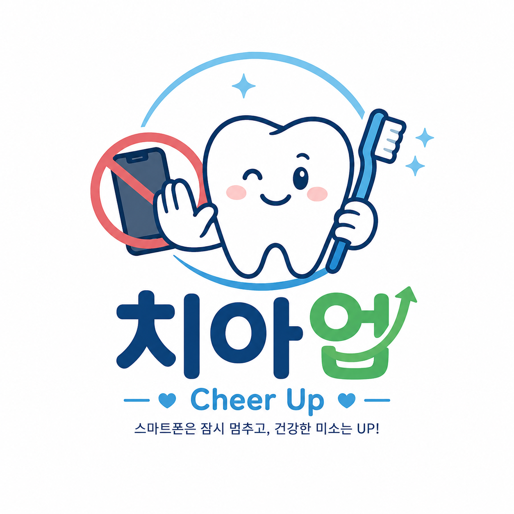

<div align="center">



# 🦷 청소년 스마트폰 의존·수면의 질에 따른<br>구강 건강 위험도 예측 서비스

**공공 보건 데이터 × 복합표본 통계 × XGBoost — 예방적 헬스케어 AI**

<br>

[](https://python.org)
[](https://xgboost.readthedocs.io)
[](https://streamlit.io)
[](https://www.statsmodels.org)
[](https://optuna.org)

<br>

[📁 데이터 출처](https://www.kdca.go.kr/yhs/)

</div>

---

## 📌 프로젝트 개요

> **"스마트폰 과의존과 수면 부족이 청소년 구강 건강을 얼마나 위협하는가?"**
> **2020 청소년 건강행태 온라인조사(KYRBS)** 데이터를 기반으로 청소년의 스마트폰 의존도·수면이 구강 건강에 미치는 영향을 분석하고, 머신러닝 분류 모델 (Machine Learning Classification Model)로 구강 건강 불량 위험군을 예측하는 프로젝트입니다.


| 항목 | 내용 |
|------|------|
| **분석 대상** | 중·고등학생 [2020 청소년 건강행태 온라인조사 (KYRBS 2020)] |
| **표본 수** | 결측치 제거 후 약 50,975명 (복합표본 가중치 적용) |
| **예측 목표** | 구강 건강 불량 여부 (`oral_poor`: 0/1) |
| **핵심 변수** | 스마트폰 사용시간, 스마트폰 의존도, 수면의 질 |
| **팀 구성** | 3팀 (세미프로젝트 1) |

---

## 🎯 핵심 성과 지표 (KPI)

| 지표 | 수치 | 비고 |
|:---:|:---:|:---:|
| 🎯 **재현율 (Recall)** | **85.21%** | 최우선 최적화 지표 (민감도 (Sensitivity)) |
| 📈 **ROC-AUC** | **0.6483** | XGBoost 최종 모델 실측값 |
| ⚖️ **F1-Score** | **66.83%** | 정밀도 (Precision) 54.98% / 재현율 (Recall) 85.21% 조화 평균 |
| ⚙️ **임계값 (Threshold) 방식** | **최적 임계값 (0.398)** | 재현율 (Recall) ≥ 0.85 만족을 위한 동적 컷오프 산출 |
| 🏆 **최종 모델** | **XGBoost** | 5개 ML 알고리즘 비교 최적화 후 최종 선정 |

> 💡 헬스케어 도메인 특성상 **위음성 (False Negative - 실제 위험군을 정상으로 판정) 최소화**를 목표로 하여, 재현율 (Recall)을 최우선 평가지표로 설정하고 임계값을 조정했습니다.

---

## 🗂️ 프로젝트 구조

```
📦 semi_1_project-main
├── 📄 01_Data_Preprocessing.py     # 원시 데이터 전처리 및 파생변수 생성
├── 📄 02_Statistical_Analysis.py   # 가중치 교차분석 + 위계적 다중 로지스틱 회귀분석
├── 📄 EDA.py                        # 탐색적 데이터 분석 및 시각화 스크립트
├── 📄 train.py                      # 5개 머신러닝 모델 학습, 파라미터 튜닝 및 성능 비교
├── 📄 app.py                        # Streamlit 예측 서비스 (기본 모델 경로 참조)
├── 📄 xg_app.py                     # Streamlit 예측 서비스 (로컬 모델 경로 참조)
├── 📄 generate_images.py            # 프로젝트 관련 시각화 이미지 생성 스크립트
├── 📄 index.html                    # 웹 페이지 리포트
├── 📄 requirements.txt              # 개발 환경 패키지 목록
│
├── 📂 data/
│   └── 📄 kyrbs2020_clean_v1.csv    # 전처리 완료된 학습 데이터셋
│
├── 📂 models/                       # 학습 결과물 및 메타데이터 저장 경로
│   ├── 📄 xgboost_model.pkl         # 최종 선정된 XGBoost 모델 파일
│   ├── 📄 scaler.pkl                # 가중치 반영 표준화 스케일러 (Weighted StandardScaler)
│   ├── 📄 best_params.json          # Optuna 하이퍼파라미터 튜닝 결과
│   ├── 📄 model_meta.json           # 모델 메타데이터 (임계값 및 인코딩 맵 포함)
│   └── 📊 ml_performance_table_recall.csv  # 모델별 성능 비교 검증 결과표
│
└── 📂 plots/                        # 성능 및 분석 시각화 결과물 저장 경로
    ├── 📄 01_roc_curves.png         # 모델별 ROC 커브 비교
    ├── 📄 03_confusion_matrix_best.png  # 최종 모델 혼동 행렬 (Confusion Matrix)
    └── 📄 04_feature_importance.png     # 변수 중요도 (Feature Importance) 차트
```

---

## 🔄 분석 파이프라인 (Data Pipeline)

```
SAS 원시 데이터 (.sas7bdat)
            │
            ▼
  1. 데이터 전처리 (Preprocessing) 및 결측치 제거
            │
            ▼
  2. 탐색적 데이터 분석 (EDA) 및 시각화 (Plots)
            │
            ▼
  3. Rao-Scott 카이제곱 검정 및 위계적 다중 로지스틱 회귀분석
            │
            ▼
  4. 머신러닝 모델 학습 및 성능 평가 (5개 모델 비교)
            │
            ▼
  5. 최종 예측 모델 선정 (XGBoost) 및 가중치 스케일러 저장
            │
            ▼
  6. Streamlit 웹 서비스 구현 및 배포 (app.py)
```

---

## 1️⃣ 데이터 전처리 (`01_Data_Preprocessing.py`)

KYRBS 2020 SAS 원시 데이터에서 주요 변수를 추출하고 분석에 적합한 형태의 파생변수 (Derived Variable)를 생성했습니다.

### 📊 주요 변수 매핑 및 범주화 기준

| 변수 (Variable) | 원시 코드 (Raw Code) | 변환 기준 (Mapping Rule) |
|------|-----------|-----------|
| `gender` (성별) | SEX | 1 → Male (남학생) / 2 → Female (여학생) |
| `school` (학교급) | GRADE | 1\~3 → Middle school (중학교) / 4\~6 → High school (고등학교) |
| `grade` (성적수준) | E_S_RCRD | 1\~2 → High (상) / 3 → Middle (중) / 4\~5 → Low (하) |
| `income` (경제수준) | E_SES | 1\~2 → High (상) / 3 → Middle (중) / 4\~5 → Low (하) |
| `smartphone_use_day/weekend`<br>(스마트폰 사용시간) | INT_SPWD_TM<br>INT_SPWK_TM | 분 단위 수치를 시간 단위로 환산 후 4구간 범주화<br>(≤3시간 / 3\~5시간 / 5\~8시간 / ≥8시간) |
| `smartphone_dependence`<br>(스마트폰 의존도) | INT_SP_OU_1\~10 | 한국지능정보사회진흥원(NIA) S-Scale 10개 문항 점수 합산<br>- 23점 미만 → No (일반군)<br>- 23점 이상 → Risk (위험군) |
| `anxiety` (불안) | M_GAD_1\~7 | GAD-7 7개 문항 점수 합산 (각 문항 0\~3점 변환)<br>0\~4 → No / 5\~9 → Mild / 10\~14 → Moderate / 15\~ → Severe |
| `stress` (스트레스) | M_STR | 1\~2 → High (상) / 3 → Middle (중) / 4\~5 → Low (하) |
| `sleep_quality` (수면의 질) | M_SLP_EN | 주관적 피로 회복 정도<br>1\~2 → No (충분/양호) / 3\~5 → Yes (부족/문제) |
| **`oral_health` (타겟 변수)** | O_SYMP1\~4 | 치아 파절, chewing discomfort(씹기 불편), 치아 통증, 잇몸 출혈 증상 중 1개 이상 경험 시 → Yes (1) / 없음 → No (0) |

> 📌 **결측치 처리**: 리스트와이즈 삭제 (Listwise Deletion) 적용 ➡️ 최종 분석 대상 **50,975명** (선행 연구 논문과 동일한 표본 수치 확보)

---

## 2️⃣ 탐색적 데이터 분석 (`EDA.py`)

### 📈 주요 시각화 및 탐색적 데이터 분석 (EDA) 항목
- **인구통계학적 분포**: 복합표본 가중치를 반영한 성별, 학교급, 학업성적, 가정형편 분석 (막대/파이 차트)
- **스마트폰 의존도 및 정신건강 분포**: 스마트폰 의존 위험군 비율, 불안 수준, 스트레스, 절망감, 자살 생각 지표 분포 시각화
- **복합 위험인자 분석**: 스마트폰 의존도와 수면의 질이 구강 건강에 미치는 복합적 영향 (누적 막대 비율 차트)
- **상관관계 히트맵 (Correlation Heatmap)**: 가중 스피어만 상관계수 (Weighted Spearman Correlation Coefficient) 적용 분석

---

## 3️⃣ 통계 분석 — 위계적 다중 로지스틱 회귀 (`02_Statistical_Analysis.py`)

복합표본 설계를 반영한 **Rao-Scott 1차 보정 카이제곱 검정 (Rao-Scott Chi-Square Test)**으로 독립성을 검증한 후, **위계적 로지스틱 회귀분석 (Hierarchical Logistic Regression)**을 실시하여 변수군별 설명력을 단계적으로 확인했습니다.

### 🔬 위계적 회귀 모델 구성 (Model Blocks)

| 구분 | 투입 변수 (Features) | 분석 목적 |
|------|-----------|------|
| **Model 1** | 성별, 학교급, 성적, 가구소득, 불안, 스트레스, 절망감, 자살생각 | 인구학적 특성 및 정신건강 변수의 통제 효과 확인 |
| **Model 2** | Model 1 + 주중/주말 스마트폰 사용시간, 스마트폰 의존도 | 스마트폰 사용 패턴의 추가적 구강 건강 위험 효과 확인 |
| **Model 3** | Model 2 + 수면의 질 (최종 모델) | 수면의 질이 지닌 추가 설명력 및 매개 효과 분석 |

- **다중공선성 (Multicollinearity) 검증**: 분산팽창인자 (VIF - Variance Inflation Factor) 분석 결과, 모든 변수가 **VIF < 5**로 나타나 다중공선성 문제 없음 확인
- **모델 적합도 비교**: 편차 (Deviance), 아카이케 정보 기준 (AIC), 베이지안 정보 기준 (BIC) 활용 비교
- **통계 결과 지표**: 오즈비 (OR - Odds Ratio), 95% 신뢰구간 (95% CI), 유의확률 (p-value)

---

## 4️⃣ 머신러닝 모델 성능 비교 (`train.py`)

구강 질환 위험군을 사전에 최대한 감지하여 위음성 (False Negative)을 방지하고자 **목표 재현율 (Target Recall) ≥ 0.85**를 기준으로 각 모델의 최적 임계값 (Optimal Threshold)을 동적으로 조정하고 성능을 평가했습니다.

### 📊 머신러닝 모델 성능 비교 결과 (Test Set)

| 모델 (Model) | 최적 임계값 (Opt. Threshold) | ROC-AUC | 정확도 (Accuracy) | 정밀도 (Precision) | **재현율 (Recall)** | F1-Score | 과적합 격차 (Overfit Gap) |
|:---|:---:|:---:|:---:|:---:|:---:|:---:|:---:|
| Logistic Regression | 0.002 | 0.5808 | 0.5258 | 0.5172 | **0.8516** | 0.6435 | -0.0073 |
| Random Forest | 0.424 | 0.6463 | 0.5685 | 0.5456 | **0.8473** | 0.6638 | -0.0022 |
| **XGBoost** | **0.398** | **0.6483** | **0.5749** | **0.5498** | **0.8521** | **0.6683** | **0.0066** |
| LightGBM | 0.398 | 0.6487 | 0.5752 | 0.5501 | 0.8506 | 0.6681 | 0.0056 |
| CatBoost | 0.408 | 0.6484 | 0.5756 | 0.5504 | 0.8500 | 0.6681 | -0.0027 |

> 📌 **하이퍼파라미터 튜닝 (Hyperparameter Tuning)**: Optuna를 이용해 30회 베이즈 최적화를 수행하여 학습 파라미터를 산출하였습니다. (상세 내역은 `models/best_params.json` 참고)

---

## 5️⃣ 최종 모델 선정 및 상세 지표 — XGBoost

재현율 (Recall), ROC-AUC, F1-Score의 균형과 기차 모델 대비 과적합 (Overfitting) 격차가 매우 적은 점을 고려하여 **XGBoost**를 최종 예측 모델로 선정했습니다.

### 🏆 XGBoost 최종 성능 결과 요약

- **ROC-AUC**: 0.6483
- **재현율 (Recall)**: 0.8521
- **F1-Score**: 0.6683
- **Youden's Index 기준 최적 임계값**: 0.4996 (Youden's J = 0.2324, 민감도 = 0.6092, 특이도 = 0.6232)
- **목표 재현율 (Recall ≥ 0.85) 조정 임계값**: 0.397 (또는 0.398)

### 🧩 모델 입력 특성 (12개 변수)
1. `gender` (성별)
2. `school` (학교급)
3. `grade` (성적수준)
4. `income` (경제수준)
5. `anxiety` (불안)
6. `stress` (스트레스)
7. `despair` (절망감)
8. `suicidal_thoughts` (자살생각)
9. `smartphone_use_day` (주중 스마트폰 사용시간)
10. `smartphone_use_weekend` (주말 스마트폰 사용시간)
11. `smartphone_dependence` (스마트폰 의존 위험군 여부)
12. `sleep_quality` (수면의 질 불량 여부)

---

## 6️⃣ Streamlit 예측 서비스 (`app.py` / `xg_app.py`)

학습된 최종 XGBoost 모델을 기반으로 청소년의 사용 데이터를 입력받아 구강 건강 불량 위험도를 실시간으로 예측하는 웹 대시보드 서비스를 구현했습니다.

### 주요 기능

- 📋 **설문 형식 입력**: 12개 주요 입력 변수를 드롭다운과 라디오 버튼으로 직관적으로 입력할 수 있게 구성했습니다.
- 🎯 **위험도 예측 (Risk Prediction)**: 기계학습 모델의 예측 확률값에 따라 3단계 위험 등급(낮음/보통/높음)을 실시간으로 판정합니다.
- 📊 **결과 시각화 (Visualization)**: 위험도 단계별 맞춤형 테마 컬러 카드 레이아웃과 수치적인 발생 확률을 표기합니다.
- ⚙️ **임계값 (Threshold) 적용**: 재현율 (Recall) ≥ 0.85 수준의 최적화 임계값(0.397)을 자동 적용하여, 의료 예방적 관점에서 위험 대상을 놓치는 위험(위음성 (False Negative))을 예방합니다.

### 📂 탭별 상세 구조

1. **📱 스마트폰 과의존 탭**
   - 스마트폰 과의존의 개요 및 한국지능정보사회진흥원 (NIA) 표준 척도 기준의 3대 핵심 현상 (조절실패, 현저성, 문제적 결과) 교육 정보를 수록했습니다.
   - S-Scale 점수 기준 고위험군(31점 이상), 잠재적 위험군(23~30점), 일반군(22점 이하)에 대한 가이드라인을 제공합니다.

2. **🎯 구강 예측하기 탭**
   - 인구통계학적 배경 (성별, 학교급, 학업성적, 경제수준)과 수면의 질, 스마트폰 주중/주말 사용 시간 및 S-Scale 10대 질문 문항을 편리하게 수집합니다.
   - 입력 직후 XGBoost 모델이 결과를 연산하여 의존도 유형 및 구강 건강 위험 확률을 반환합니다.
   <p align="center">
     
   </p>

3. **💡 맞춤형 솔루션 탭**
   - 예측 결과에 따라 개인 맞춤형 행동 규칙을 제안하는 4대 솔루션 카드 디자인을 구현했습니다.
     - 🔴 **집중 케어 솔루션**: 스마트폰 과의존 위험군 및 구강 위험 판정 대상자 가이드
     - 🟡 **구강 집중 솔루션**: 스마트폰 일반군이지만 구강 위험 판정 대상자 가이드
     - 🔵 **스마트폰 디톡스 솔루션**: 스마트폰 의존 위험군이지만 구강 정상 대상자 가이드
     - 🟢 **건강 유지 솔루션**: 스마트폰 일반군 및 구강 정상으로 건강 습관 유지 가이드
   - 추가적으로 주변 치과 지도 검색 링크 제공 및 예약 접수 양식을 통한 의료기관 진료 연계도 함께 지원합니다.
   <p align="center">
     
   </p>

4. **🏫 자료실 탭**
   - **📊 통계 예측지도 (EDA 대시보드)**: 실제 수집 데이터의 스마트폰 사용시간별 구강 증상 비율, 의존도 비율, 수면-의존 복합 위험도 교차 분석 등의 Plotly 반응형 그래프를 포함하는 시각화 대시보드를 제공합니다.
   - **📘 관리 가이드**: 건강한 디지털 일상 리듬과 필수 구강 위생 관리(칫솔질, 치실) 요령을 안내합니다.
   - **프로그램 안내**: 디지털 중독 예방 캠프(가족/기숙 치유캠프 등) 및 학부모 교육용 예방 자료를 안내합니다.
   <p align="center">
     
   </p>

---

## 🛠️ 기술 스택 (Technology Stack)

- **언어 및 프레임워크 (Core)**: Python (3.10+), Streamlit
- **데이터 전처리 (Data Processing)**: Pandas, NumPy
- **통계 분석 (Statistical Analysis)**: SciPy (`chi2_contingency`), Statsmodels (GLM - Binomial)
- **머신러닝 (Machine Learning)**: Scikit-learn, XGBoost, LightGBM, CatBoost
- **하이퍼파라미터 최적화 (Optimization)**: Optuna
- **시각화 (Visualization)**: Matplotlib, Seaborn, Plotly Express

---

## ⚙️ 실행 및 환경 구성 방법

### 1. 패키지 설치
로컬 터미널에서 다음 명령어를 실행하여 필요한 패키지를 설치합니다.
```bash
pip install -r requirements.txt
```

### 2. 머신러닝 파이프라인 실행 (모델 재학습 및 저장)
전처리된 데이터로 5대 모델의 하이퍼파라미터 베이즈 최적화 학습을 수행하고, 최종 XGBoost 모델과 가중치 스케일러를 `./models` 경로에 내보냅니다.
```bash
python train.py
```

### 3. Streamlit 웹 서비스 구동
로컬에서 Streamlit 예측 서비스를 실행합니다.
```bash
# 기본 버전 실행 (models/ 폴더 내부의 모델 및 메타데이터를 참조합니다)
streamlit run app.py
```
> ⚠️ **참고**: `xg_app.py` 스크립트는 모델 출력 경로가 절대 경로로 지정되어 있으므로, 상대 경로로 구동하려면 `app.py`를 실행하시는 것을 적극 권장합니다.

---

## 🔍 프로젝트 핵심 인사이트

1. **스마트폰 과의존과 구강 건강**: 스마트폰 의존 위험군은 일반군에 비해 구강 증상 발생률이 통계적으로 유의미하게 높음 (Rao-Scott 카이제곱 검정, $p < 0.001$).
2. **수면의 매개 효과**: 수면 부족(수면의 질 불량) 집단에서 구강 질환 증상 비율이 크게 증가하였으며, 스마트폰 사용과 구강 건강 사이의 매개인자로 작용할 가능성이 높음.
3. **이중 위험군의 구강 건강 폭증**: 스마트폰 의존 위험군이면서 동시에 수면 부족에 해당하는 청소년 집단은 구강 증상 경험 비율이 59.43%에 달해 집중 관리가 필요함.
4. **위험군 탐지에 특화된 모델링**: 오버피팅을 극 최소화한 XGBoost 모델에 Youden's Index 및 임계값 튜닝을 가미하여 **재현율 (Recall) 85.21%**를 달성, 실제 위험 대상을 빠뜨리지 않고 걸러낼 수 있는 성능을 확보함.

---
데이터 출처: [질병관리청 청소년건강행태조사](https://www.kdca.go.kr) (제16차, 2020년)
